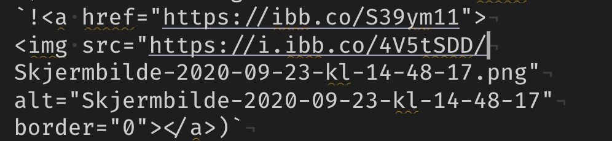
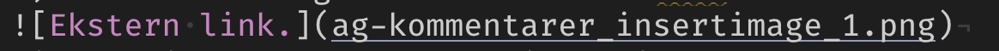

1) Dere hadde slettet local master. Jeg startet med å lage en ny branch local master (haker av for sync med origin). Systemet gir beskjed at jeg allrede har en origin/master og spør om jeg vil gjøre checkout. Velger dette og ting ser ut til nå å være ok (origin/master kopiert til local/master)
2) Dobbel formatering av headers, bare ødelegger. Følg markdown
3) YAML liker ikke underscore. REname fra Mitt_bibliotek.bib til Mitt-bibliotek.bib. Samsvarer også med «vår» standard, snake_scape på R objekter, kebab_scape på filnavn.
4) Dere hadde lagt inn en ekstern html link 

til et bilde. Legg heller bildet i samme mappe som dokumentet og bruk en relativ link i markdown

5) Fikset `

` så nå skal referanser virke
6) Navn på bib fil må stå i anførselstegn i YAML
7) Dere hadde bibliiography og ikke bibliography i YAML
8) Nå skal addin `citr` virke. Legg inn litt mer referanser i teksten
9) En del skjemmende skrivefeil. Velg norsk ordliste under spelling under Prefs/Options. Vil da være lett å luke vekk med klikk understreket ord og velg fra meny
